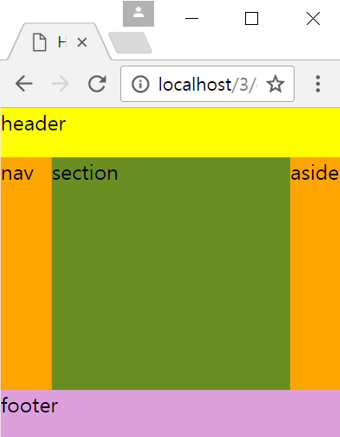

# 01. 자바스크립트 수업_01

---

## 구조화된 HTML 문서 작성

```javascript
<!DOCTYPE html>
<html lang="en">
<head>
    <meta charset="UTF-8">
    <meta name="viewport" content="width=device-width, initial-scale=1.0">
    <title>Document</title>
    <style>
        html, body{
            margin: 0; padding: 0; height: 100%;
        }
        header{
            width: 100%; height: 15%; float: left; background-color: yellow;
        }
        nav{
            width: 15%; height: 70%; float: left; background-color: orange;
        }
        section{
            width: 70%; height: 70%; float: left; background-color: olivedrab;
        }
        aside{
            width: 15%; height: 70%; float: left; background-color: orange;
        }
        footer{
            width: 100%; height: 15%; clear: both; background-color: plum;
        }
    </style>
</head>
<body>
    <header>header</header>
    <nav>nav</nav>
    <section>section</section>        
    <aside>aside</aside>
    <footer>footer</footer>
</body>
</html>

```


;

